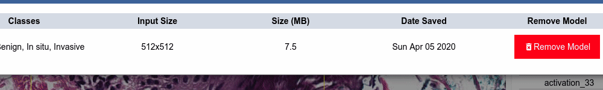

<h2 align="center">
  <a href="http://camicroscope.org/"></a>
</h2>

caMicroscope is a web-based biomedical image and data viewer, with a strong emphasis on cancer pathology WSI (Whole Slide Imaging).
This guide has sections for different kinds of use of the platform. The [User Guide](#user-guide) covers the basics on how to use caMicroscope viewer. <a href="https://github.com/SBU-BMI/Nanoborb#nanoborb" target="_blank" rel="noopener noreferrer">nanoBorb</a> covers nanoBorb, the version of caMicroscope designed as a standalone application for individual users without a server. [Hosted Setup](#hosted-setup) covers how to set up caMicroscope for multiple users on a server. [Developer Guide](#developer-guide) covers the broad strokes on how to add new functionality to caMicroscope.




# User Guide

## Selecting an Image
Depending on what is providing the image metadata, a different login process may be necessary. For public instances, no log in is necessary, and you can proceed to view slides. Use of other tools, such as annotations may or may not require login in this case.
For slim instances, login should be done through a redirect directly. For pathDB instances, login should be done on the login link on the main page.
At this point, select a collection, if applicable, and proceed to open or "view" the image of your choice.

## Viewing an Image
Once an image is open, you can pan around the image by either clicking and dragging (when no conflicting tool, such as the pen, is open), or by moving the red bounding box in the viewport in the bottom right.
Zooming can be accomplished through the scroll wheel, pinch events on a touch screen, by using the zoom slider or its associated buttons, or by clicking on the zoom number and inputting a different number.

## Using Tools
The toolbar is in the top-left of the main content window. Use the toolbar buttons to manipulate the slide. To close any toolbar button, click the same button again or a new button.

| Tool  | Name        | Function  |
| ----- |-------------| -----|
|       | Annotations | Opens the Annotation panel, where you can select which annotation set to view, name that annotation set, add optional notes about the annotation set, save the annotation set, and reset the panel to its original state. |
|       | Layer Manager      | Opens the Layers Manager panel, where you can select which layers to view. |
|       | Home      | Return to the data table so that you can open another slide.|
|       | Draw      |  Draw thin lines, thick lines, or polygons on the image. Annotations can also be computer aided using the Smart-pen tool. Draw them, stretch them, remove them. To maintain the integrity of measurements, avoid drawing shapes that overlap or intersect one another. |
|       | Preset Labels      |  Use a preset annotation type immediately to quickly annotate a slide consistently. |
|        | Magnifier      |The Magnifier works like a magnifying glass and allows you to see the slide at normal magnification (1.0), low magnification (0.5), or high magnification (2.0). Click a magnification level and place the bounding box on the area of the slide you want to magnify. |
|       | Measurement      | Drag this tool on the slide to learn the measurement in micrometers. |
|       | Share View      |Opens a window with a URL to the current presentation state of the slide including the magnification level, layers that are currently open, and your position on the image.|
|       | Side by Side Viewer     |Shows the Layer Manager panel, the left and right layers, and inset window. For the right and left layer, select which layer you want to view. |
|       | Heatmap     | For a slide with heatmap data, opens the choices of heatmaps available, as well as ways of displaying the heatmaps. The gradient shows all of the values on the selected spectrum for the field you selected. Contains a heatmap edit pen function.|
|       | Labeling      |Use this tool to draw a circle or rectangle around a tumor region, measure an area on the slide, download labels, and submit a bug report. The Labeling tool has its own toolbar with tools in the following order from left to right: return to the previous slide, place a square on the slide, place a circle on the slide, measure an area, download labels, and submit a bug report. Click the left arrow at the far right of the toolbar to hide it, then click the right arrow to show it. |
|       | Segment      | This tool allows you to display, count, and export nuclear segmentations on the image. Clicking this tool opens the following custom toolbar. |
|       | Model      | Show results from a pre-trained tensorflow compatible model on a ROI of the slide. |
|       | Download Slide      | Download the slide image to your system |
|       | Mark Reviewed      | Use to signify the completion of review of a slide. |
|       | Bug Report      | Report a bug or give feedback. |
|       | Slide Capture      | Click to take a screenshot of the slide and annotations on it. |
|       | Tutorial      | Click to view a guided tour of the viewer tools. |
|       | Visualization   | Click to view visualizations of annotations. |

## Toolbar Shortcuts

| Tool         | Shortcut  |
|------------- |-----------|
| Annotation   |  Ctrl + a |
| Magnifier    |  Ctrl + m |
| Measurement    |  Ctrl + r |
| Side-by-Side |  Ctrl + s |
| Close all tools |  ESC   |

# Hosted Setup
The full distribution repository for hosted caMicroscope is [here](https://github.com/camicroscope/Distro/).
run with `docker-compose -f caMicroscope.yml up`

this will build all services and run in the foreground.
Use `docker-compose -f caMicroscope.yml build` to rebuild the services.

Once everything is up, go to \<the host this is running on\>:4010/ to see the landing page.

# Other Resources
- **Slack:** <http://bit.ly/camicroscope>
- **Discussion mailing list:** <https://groups.google.com/g/camicroscope>
- **Sample Tensorflow Models:** <https://github.com/camicroscope/tfjs-models>

# Developer Guide
We are collecting feedback to write this section in more detail. Please add your suggestions [here](https://github.com/camicroscope/caMicroscope/issues/267).

caMicroscope is open source software. Any involvement and contribution with the caMicroscope project is greatly appreciated. Feel free to get directly involved in any of the repositories in the caMicroscope organization. New developers may find the notes in [CONTRIBUTING](https://github.com/camicroscope/caMicroscope/blob/master/CONTRIBUTING.md) helpful to start contributing to caMicroscope.

It is highly recommended to make any changes off of the develop branch of a repository, and, when ready, create a PR to the develop branch of the source repository. Before sending the PR, make sure that there are no linting errors by running ```npm install``` and then ```npm run lint```  to see the errors and ```npm run lint-fix``` to automatically fix the errors in the repository folder.

Source code organization ie the file structure of caMicroscope can be found in [file structure](https://github.com/camicroscope/caMicroscope/blob/master/docs/file_structure.md)

## Fast Local Changes
When using the hosted setup, you can have the distribution host the changes from your local. Follow these steps :
- Clone this repository, the [Caracal repository](https://github.com/camicroscope/Caracal/) and [the distribution](https://github.com/camicroscope/Distro/) in the same parent directory
- Set the build to build your local changes instead of the hosted git versions by editing the ca-back container section of your develop.yml. Replace the build context section with the path to your caracal checkout ("../Caracal"), and add `- ../caMicroscope:/src/camicroscope` to the volumes.
- Remove this line from 'Dockerfile' in Caracal repository :
```
RUN git clone https://github.com/${fork:-camicroscope}/camicroscope.git --branch=${viewer:-master}
```
- In Distro repository, enter the following commands :
```
docker-compose -f develop.yml build
docker-compose -f develop.yml up
```
