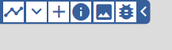
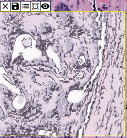
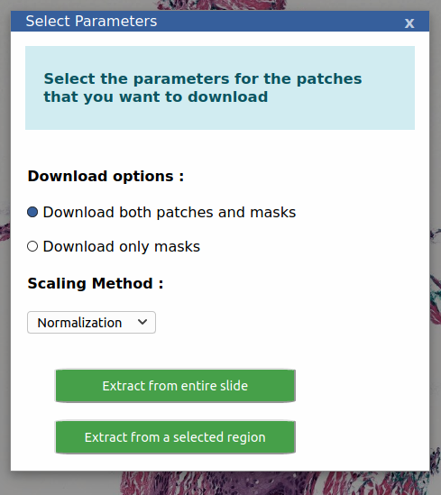

# Segment App

## Lite Segmentation
> Segments nuclear material and allows testing segmentation models

<!--  -->

### Example usage

Select the Segmentation button on the toolbar.  Hint: It's the one on the far right.

### Nuclei Segmentation
Helps to quickly identify possible nuclear material.  (User-adjustable slider to follow.)

Next, zoom in to an area that you would like to segment.

Clicking the Segmentation button again will provide you with the ability to draw a rectangular region of interest.

Scrolling to the bottom will show the region you selected, segmented.

### Testing Segmentation models

Clicking the plus icon will allow adding a Keras/tensorflowjs trained model.

Select the desired model from the dropdown and select the required area.

Toggle the mask or change the opacity as required.
Save the mask using the save button.

## Region of Interest (roi) Extraction

> Allows downloading patches and masks from current slide by applying a segmentation model.

### Example usage 

Clicking on the roi button opens a window to choose a model from the available ones. Select a desired model.

Now, choose if you want to download only masks or both masks and patches from the next menu. 

Next, choose if you want to download patches/masks from the complete slide or from a selected region. If you want to download from a selected region, select the region next. After this the segmentation and extraction process will begin . Once finished you'll be prompted to download the patches/masks on your local computer. 

