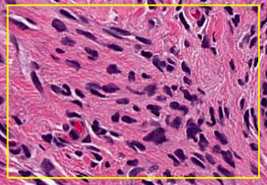

# Lite Segmentation
> Segments nuclear material.

Helps to quickly identify possible nuclear material.  (User-adjustable slider to follow.)

<!--  -->

## Example usage

Select the Segmentation button on the toolbar.  Hint: It's the one on the far right.

Next, zoom in to an area that you would like to segment.

Clicking the Segmentation button again will provide you with the ability to draw a rectangular region of interest.

Scrolling to the bottom will show the region you selected, segmented.

