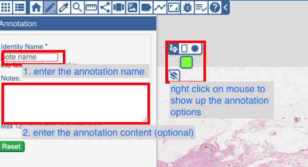
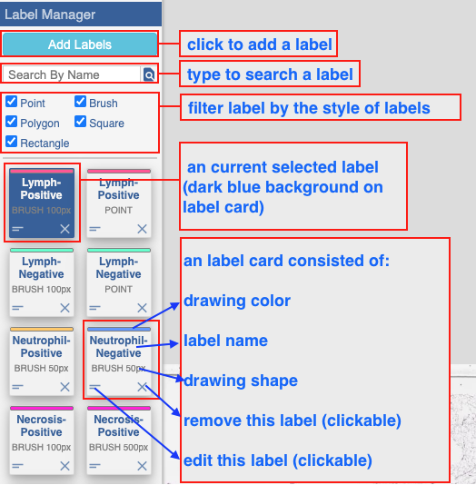
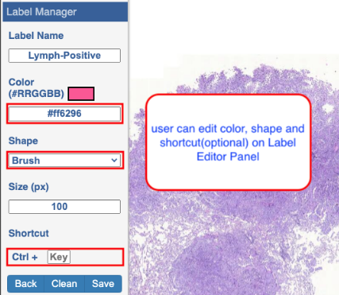

# Reviewing using caMicroscope
This guide aims to flatten the learning curve needed to perform review on slides quickly and efficiently.

## Creating Annotations
It may be useful to add annotations to aid with review, or for any other reason. Using the pencil button will bring up a form, in which you can add a name (required) and any other freeform notes (optional). After the form is filled out, drawing on the slide will create that annotation automatically. Alternatively, you can group annotations by clicking on the pencil again, and having it enter infinite mode. In this mode, you can create multiple annotations with the same name and notes at once, but you must click save when finished.

1. Enter the annotation name
2. Enter the annotation note
3. Changing the drawing options for the annotation
4. Drawing on the slide

## Customizing Your Annotations
Right click on the mouse to show up the annotation drawing options. In drawing options, there are 3 options (drawing option, color option, and clean option).
Different situations require different kinds of annotation, so caMicroscope natively supports give varieties of annotation shape.

1. Freeform Polygon (default)
2. Point
3. Square
4. Rectangle
5. Grid Selection ("Brush as Grid")

## Preset Annotation Labels
caMicroscope provides the preset labels to associate users to quickly create annotations on the slide.

### Customizing Preset Labels
To further increase efficiency for specific cases, we recommend changing the preset labels to match the kinds of review that is desired. Consider setting a keyboard shortcut to further decrease time menuing.

